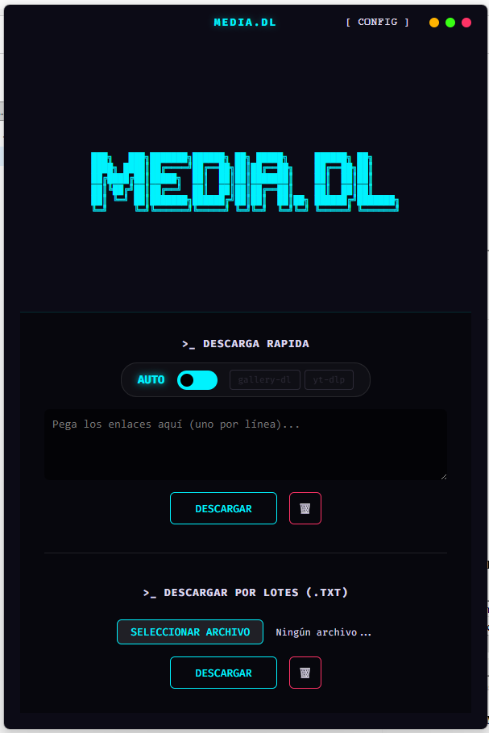

# MEDIA.DL

<div align="center">
  
  <h3>GALLERY-DL/YT-DLP UI</h3>
</div>



## Descripción
**MEDIA.DL** es una interfaz gráfica (GUI) para realizar descargas masivas de videos, imágenes y audio desde cientos de sitios web, impulsada por **yt-dlp** y **gallery-dl**.

### ✨ Características Principales
- **Modo AUTO:** Detección inteligente del enlace para usar el mejor motor disponible.
- **Gestor de Cookies:** Carga múltiples archivos de cookies (.txt) para descargar contenido de cuentas privadas.
- **Descargas Simultáneas:** Soporte para descargas en paralelo (1, 3, 5, 10 o personalizado).
- **Actualizador Integrado:** Busca e instala las últimas versiones de los motores sin salir de la app.
- **Interfaz Cyberpunk/Neón:** Temas fluidos y alertas de hover modernas.

---

## Instalación

1. **Clonar o descargar:**
   ```bash
   git clone https://github.com/jorgealbertoortiznieves-lab/MEDIA.DL.git
   cd MEDIA.DL
   ```
2. **Instalar dependencias:**
   ```bash
   npm install
   ```
3. **Ejecutar la app en modo desarrollo:**
   ```bash
   npm start
   ```

---

## ⚠️ Configuración Obligatoria (Motores)

Esta aplicación es una interfaz gráfica, por lo que **necesita los motores originales para poder descargar**. Si intentas descargar sin ellos, la app te avisará con un error visual.

Para habilitar las descargas, debes crear una carpeta llamada `bin/` en la raíz del proyecto y colocar allí los ejecutables:

1. **yt-dlp**: Descarga `yt-dlp.exe` desde su [repositorio oficial](https://github.com/yt-dlp/yt-dlp/releases) y colócalo en la carpeta `bin/`.
2. **gallery-dl**: Descarga `gallery-dl-app.exe` (el binario de Windows) desde su [repositorio oficial](https://github.com/mikf/gallery-dl/releases) y colócalo en la carpeta `bin/`.

> **Nota:** La aplicación autogenerará un archivo `config1.json` básico en la carpeta `bin/` si detecta que falta al usar gallery-dl.
